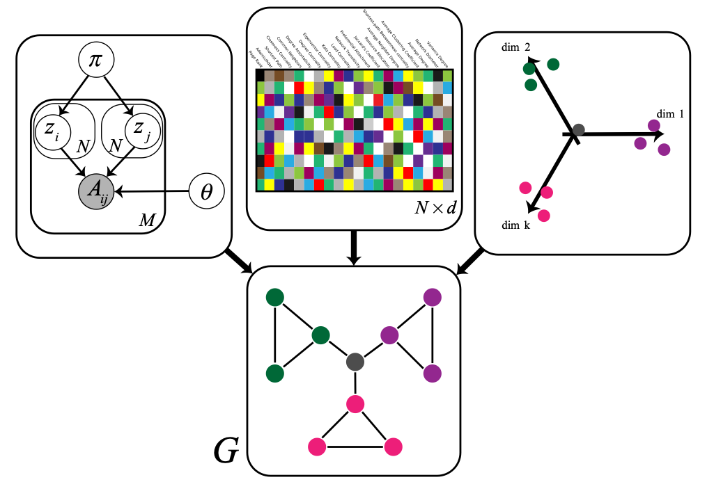
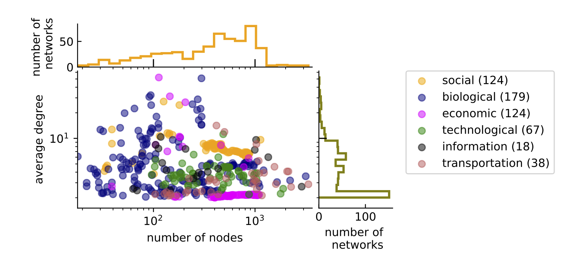
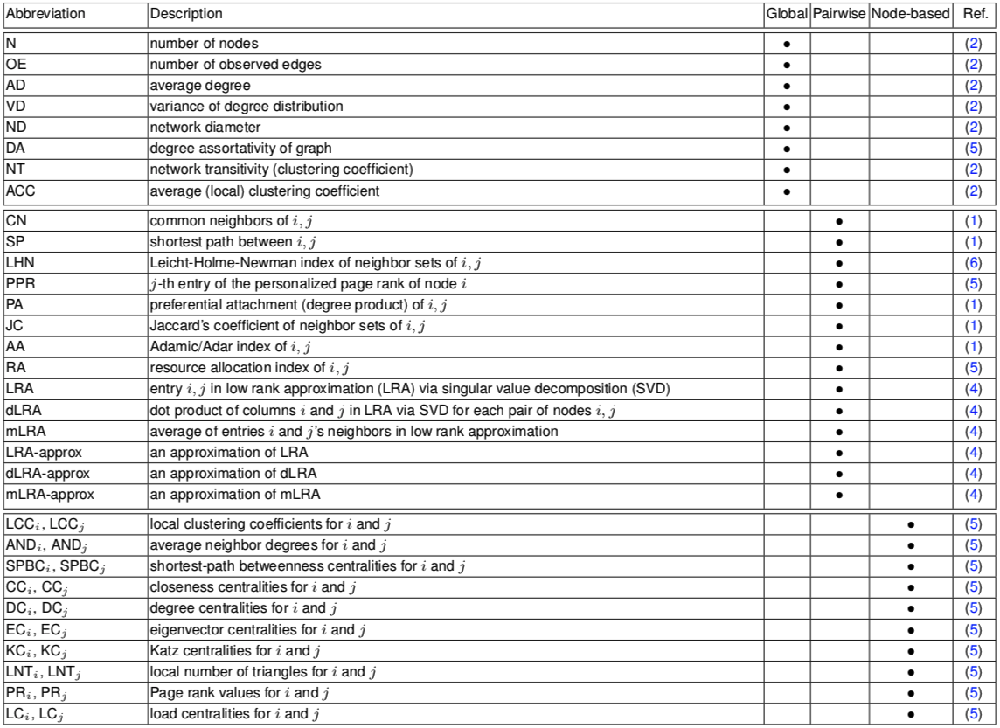
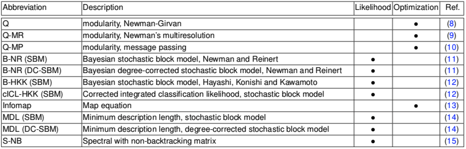
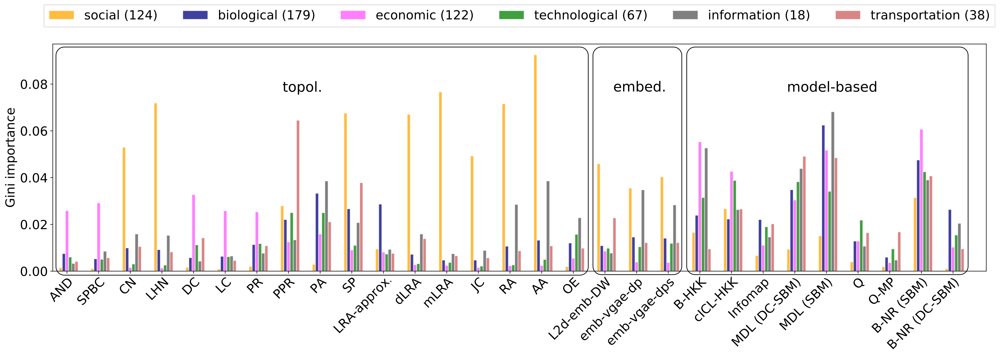

# Optimal Link Prediction

 

This page is a companion for our paper on optimal link prediction, written by <a href = "https://aghasemian.github.io">Amir Ghasemian</a>, <a href = "https://homahm.github.io">Homa Hosseinmardi</a>, <a href = "https://www.isi.edu/people/galstyan/about">Aram Galstyan</a>, <a href = "http://www.people.fas.harvard.edu/~airoldi/">Edoardo Airoldi</a>, and <a href="http://santafe.edu/~aaronc/">Aaron Clauset</a>. (arXiv:...)
In this page we provide (i) a reference set of networks as a benchmark for link prediction (Fig. S1 of the paper), (ii) the necessary code to generate 42 topological features for each network (Table S1 of the paper), and (iii) a useful stacking method to combine these topological features to be used in link prediction.

 
<b>Fig. S1 of the paper</b>

 
<b>Table S1 of the paper</b>

 The most common approach to predict missing links constructs a score function from network statistics of each unconnected node pair. We studied 42 of these topological predictors in this paper, which include predictions based on node degrees, common neighbors, random walks, node and edge centralities, among others (see SI Appendix, Table S1). Models of large-scale network structure and close proximity of an unconnected pair, after embedding a network's nodes into a latent space are also commonly used for link prediction. We have also studied 11 of the model-based methods (Table S2 of the paper), besides 150 of the embedding-based predictors, derived from two popular graph embedding algorithms and six notions of distance or similarity in the latent space in this work. In total, we considered 203 features of node pairs. 

 
<b>Table S2 of the paper</b>

Across domains, predictor importances cluster in interesting ways, such that some individual and some families of predictors perform better on specific domains. For instance, examining the 10 most-important predictors by domain (29 unique predictors; Fig. 1 of the paper), we find that topological methods, such as those based on common neighbors or localized random walks, perform well on social networks but less well on networks from other domains. In contrast, model-based methods perform relatively well across domains, but often perform less well on social networks than do topological measures and some embedding-based methods. Together, these results indicate that predictor methods exhibit a broad diversity of errors, which tend correlate somewhat with scientific domain.

 
<b>Fig. 1 of the paper</b>

This performance heterogeneity highlights the practical relevance to link prediction of the general No Free Lunch theorem, which proves that across all possible inputs, every machine learning method has the same average performance, and hence accuracy must be assessed on a per dataset basis. The observed diversity of errors indicates that none of the 203 individual predictors is a universally-best method for the subset of all inputs that are realistic. However, that diversity also implies that a nearly-optimal link prediction method for realistic inputs could be constructed by combining individual methods so that the best individual method is applied for each given input. Such a meta-learning algorithm cannot circumvent the No Free Lunch theorem, but it can achieve optimal performance on realistic inputs by effectively redistributing its worse-than-average performance onto unrealistic inputs, which are unlikely to be encountered in practice.

 In this page we also provide one of the useful stacking methods in our paper to be accessible for all researchers in the field. In the module provided in Python we construct 42 topological features and combine them using a standard random forest as a supervised learning algorithm.

### Reference:
 <b>Stacking Models for Nearly Optimal Link Prediction in Complex Networks</b></a>
 <b>Amir Ghasemian</b>, Homa Hosseinmardi, Aram Galstyan, Edoardo Airoldi and Aaron Clauset
  (<a href="https://arxiv.org/abs/" target="_blank"> arXiv version </a>)

### Download the package:

<a href="Benchmark/OptimalLinkPrediction.pickle">Download Pickle Format</a>.

This package contains the corpus of 548 real-world networks out of 572 networks from <a href="https://github.com/Aghasemian/CommunityFitNet">CommunityFitNet</a> from many scientific domains drawn from the Index of Complex Networks (<a href="https://icon.colorado.edu/#!/">ICON</a>). This corpus spans a variety of sizes and structures, with 23% social, 22% economic, 33% biological, 12% technological, 3% information, and 7% transportation graphs (Fig. S1 of the paper). More information regarding the partitions achieved by 16 state-of-the-art community detection algorithms over these networks are provided in <a href="https://github.com/Aghasemian/CommunityFitNet"> CommunityFitNet</a>.

### Download the code:

<a href="Code/OPL.py">Topol. Stacking Method</a>.

### Instruction for running the code:

 >>> To run a demo:

<% >>> import OLP as olp %>

 >>> olp.demo() 

 To run the topological feature stacking model on one of the networks on real dataset:

 

 >>> import pickle 

 >>> infile = open('./OLS.pickle','rb')  

 >>> df = pickle.load(infile) # load the data 

  

 >>> df_edgelists = df['edges_id'] # column 'edges_id' in dataframe df includes the edge list for each network 

   

 # creat edge list for first network 

 >>> edges_orig = df_edgelists.iloc[0] # a numpy array of edge list for original graph 

 >>> import OLP as olp  

 >>> olp.topol_stacking(edges_orig) 
 

